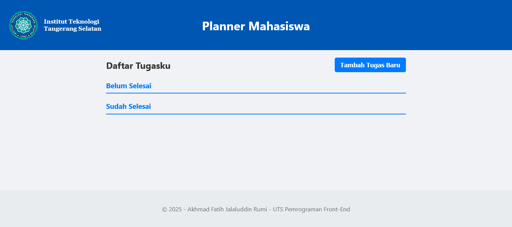

# 🌟 Aplikasi Planner Tugas Mahasiswa Interaktif (Student Planner)

## 📝 Deskripsi Proyek

Aplikasi ini adalah prototipe antarmuka pengguna (UI) berbasis web yang berfungsi sebagai **Planner Tugas Akademik Sederhana (Student Task Manager)**. Proyek ini dibuat untuk memenuhi kriteria UTS Pemrograman Front-End.

### 🎯 Fungsi dan Manfaat Aplikasi:

* **Organisasi Tugas:** Memungkinkan mahasiswa untuk mencatat, melihat, dan mengelola semua *deadline* dan tugas perkuliahan di satu tempat yang terpusat.
* **Pelacakan Status:** Memberikan visualisasi yang jelas antara tugas yang **Belum Selesai** dan tugas yang **Sudah Selesai** melalui dua daftar terpisah.
* **Interaktivitas Cepat:** Pengguna dapat dengan mudah menambah tugas melalui *modal pop-up* dan mengubah status tugas (menandai selesai atau menghapus) hanya dengan satu klik.

Secara teknis, aplikasi ini dibangun murni menggunakan **HTML, CSS, dan JavaScript (Vanilla JS)** untuk mendemonstrasikan **DOM Manipulation** dan **Event Handling**.

## 📸 Tangkapan Layar Aplikasi

## 🔗 Tautan Desain Figma

* **Desain UI/Mockup Aplikasi:** https://www.figma.com/board/eY2XweUDgU2T6iHaA3Ujrf/WORKFLOW-UTS?node-id=0-1&t=xdC1R4DtpvzKAUum-1
* **Diagram Alir (Workflow/Flow):** https://www.figma.com/design/mpMgH4zZJuabAYSewljYAw/UTS---Pemograman-Front-End?node-id=3-17&t=xdC1R4DtpvzKAUum-1
